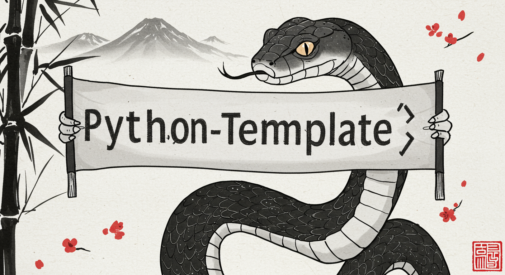

# Python-Template

<p align="center">
  
</p>

<p align="center">
  
  
</p>

## Environment Variables

Store environmnent variables in `.env` and `global_config/global_config.py`  will read those out automatically. Then, you can import them as follows:

```python
from global_config import global_config

print(global_config.OPENAI_API_KEY)
```