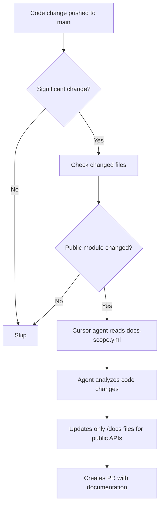

# Documentation System

This document explains the automated documentation system used in this repository.

## Overview

This repository uses an automated workflow to keep documentation in sync with code changes, with a focus on **public-facing APIs only**.

## Key Components

### 1. Documentation Scope (`.cursor/docs-scope.yml`)

Defines what needs to be documented:

- **Public modules**: User-facing code that requires comprehensive `/docs` documentation
- **Private modules**: Internal code that only needs docstrings
- **Excluded paths**: Things that should never be documented

**Location**: `.cursor/docs-scope.yml`

### 2. Documentation Rules (`.cursor/rules/documentation.mdc`)

Cursor agent rules that enforce documentation standards:

- What should be documented in `/docs` vs just docstrings
- Documentation quality requirements
- Public vs private API markers

**Location**: `.cursor/rules/documentation.mdc`

### 3. Automated Workflow (`.github/workflows/cursor_update_docs.yml`)

GitHub Actions workflow that:

- Detects significant code changes to public modules
- Triggers Cursor agent to update documentation
- Creates a PR with documentation updates
- **Only allows changes to `/docs` directory**

**Location**: `.github/workflows/cursor_update_docs.yml`

## How It Works

### Automatic Triggers

The documentation workflow triggers when:

1. **Public modules change**: Any changes to paths in `public_modules` (e.g., `common/`)
2. **Significant changes**: >50 lines changed outside `/docs`
3. **Critical files change**: `__init__.py`, `global_config.*`, `README.md`

### What Gets Documented

**✅ Public-Facing APIs (Comprehensive /docs):**
- Modules in `public_modules` (e.g., `common/`)
- Exported APIs in `__all__`
- Functions/classes without leading underscore
- Code marked with `# Public API`

**❌ Private/Internal (Docstrings Only):**
- Modules in `private_modules` (e.g., `src/utils/`, `tests/`)
- Functions/classes with leading underscore
- Code marked with `# Internal only`

### Workflow Process



## Configuration

### Adding a New Public Module

Edit `.cursor/docs-scope.yml`:

```yaml
public_modules:
  - path: "your_module/"
    description: "Description of this module"
    doc_level: "comprehensive"
    doc_files:
      - "docs/api/your_module.md"
```

And update the workflow in `.github/workflows/cursor_update_docs.yml`:

```bash
# Add check for your module
if echo "$CHANGED_FILES" | grep -q "^your_module/"; then
  PUBLIC_MODULE_CHANGED=true
  echo "Public module 'your_module/' was modified"
fi
```

### Marking Code as Public/Private

See [API Visibility Guide](./api/api-visibility-guide.md) for details.

**Quick examples:**

```python
# Public API
def public_function():
    """This will be documented in /docs."""
    pass

# Internal only
def _private_function():
    """This only needs docstrings."""
    pass
```

## Documentation Structure

```
docs/
├── api/                    # API reference documentation
│   ├── common.md          # Documentation for common/ module
│   └── api-visibility-guide.md
├── guides/                # User guides and tutorials
├── setup/                 # Setup and configuration
├── examples/              # Code examples
├── prompts/               # LLM prompts
└── commands/              # CLI commands
```

## Safety Features

The automated workflow has strict restrictions:

- ✅ **CAN** modify files in `/docs`
- ❌ **CANNOT** modify code files (`.py`, `.js`, etc.)
- ❌ **CANNOT** modify config files (`pyproject.toml`, etc.)
- ❌ **CANNOT** modify CI/CD files (`.github/workflows/`)
- ❌ **CANNOT** modify files outside `/docs`

These restrictions are enforced in the workflow prompt to prevent accidental code changes.

## For Developers

### When Adding New Features

1. **Write your code** in the appropriate module
2. **Mark visibility**:
   - Public API → No leading underscore, add to `__all__`
   - Private → Use leading underscore or put in `_internal.py`
3. **Add docstrings** to all functions and classes
4. **For public APIs**: The automated workflow will create a documentation PR
5. **Review the PR** and merge once documentation looks good

### Manual Documentation Updates

If you need to manually update documentation:

1. Edit files in `/docs` directly
2. Follow the structure in `.cursor/docs-scope.yml`
3. Use the [API Visibility Guide](./api/api-visibility-guide.md) for reference
4. Commit and push your changes

### Testing the Workflow Locally

You can test documentation generation using the Cursor CLI:

```bash
# Make sure you have Cursor CLI installed
cursor-agent -p "Review the codebase and update documentation in /docs for any public APIs that have changed"
```

## Troubleshooting

### Workflow didn't trigger

Check:
- Was the change in a `public_module` path?
- Was it >50 lines changed outside `/docs`?
- Was a critical file pattern changed?

### Documentation PR has code changes

This shouldn't happen due to safety restrictions. If it does:
- Report it as a bug
- The workflow has `git add docs/` to prevent this

### Private code was documented

- Check `.cursor/docs-scope.yml` - is the module marked as `private`?
- Update the module classification if needed
- Remove the unnecessary docs from `/docs`

## Examples

### Example 1: Public Module Change

```python
# File: common/global_config.py
# This is in public_modules

# Public API
class GlobalConfig:
    """Global configuration manager."""
    pass
```

**Result**: Workflow triggers, creates documentation in `docs/api/common.md`

### Example 2: Private Module Change

```python
# File: src/utils/_internal.py
# This is in private_modules

def _helper():
    """Internal helper."""
    pass
```

**Result**: Workflow may trigger but won't document this in `/docs` (only in code docstrings)

### Example 3: Test Code Change

```python
# File: tests/test_config.py
# This is in private_modules

def test_config():
    """Test configuration."""
    pass
```

**Result**: No documentation in `/docs` needed

## Best Practices

1. **Focus docs on public APIs**: Users only need to know about public interfaces
2. **Keep private code minimal**: Use docstrings but don't over-document internals
3. **Update docs-scope.yml**: When adding new modules that should be public
4. **Use visibility markers**: Make it clear what's public vs private
5. **Review auto-generated docs**: The workflow creates PRs, so you can review before merging
6. **Include examples**: Public APIs should have usage examples in docs

## Related Files

- [API Visibility Guide](./api/api-visibility-guide.md) - How to mark public vs private
- `.cursor/docs-scope.yml` - Configuration for what to document
- `.cursor/rules/documentation.mdc` - Documentation standards
- `.github/workflows/cursor_update_docs.yml` - Automated workflow

## Future Improvements

Potential enhancements:

- [ ] Auto-generate API reference from docstrings
- [ ] Add documentation coverage metrics
- [ ] Integrate with PR checks to require docs for public API changes
- [ ] Support for multiple programming languages
- [ ] Documentation versioning for releases
